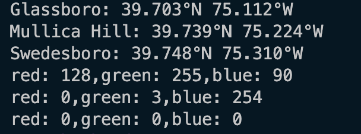

# Rust Fix Me

## Steps

- Create a Github account. (If you already have one no issues)
- Star this repository.
- Fork this repository to your Github account.
- Clone your forked repository onto your local machine.
(Remember don't clone my repository. You wont be able to push back the changes.)

##  Things to do

- Review the code and fix it so the output matches this.



- Create documentation in your own worlds using ///
- Build the documentation using ```cargo doc --target-dir .```
- Push the code changes from your local machine to your github repository.
- Submit the url of your repository.